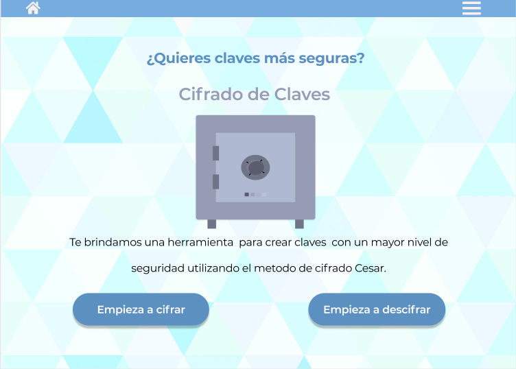
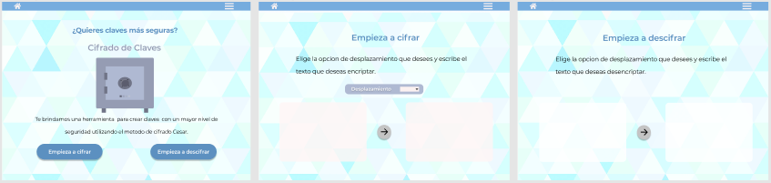

# Cifrado César

## Índice

* [1. Preámbulo](#1-preámbulo)
* [2. Resumen del proyecto](#2-resumen-del-proyecto)
* [3. Proceso de creación y diseño](#3-proceso-de-creación-y-diseño)
* [4. Figma](#4-Figma)
* [5. Explicación de uso](#5-explicación-de-uso)

***

## 1. Preámbulo

Decidí elegir el proyecto Cifrado César debido que tuve una idea desde el principio de crear una página web que le permita a los usuarios crear claves para sus cuentas online que fueran más seguras. Basandome en el hecho de que muchas personas utilizan claves en sus cuentas las cuales son muy fáciles de adivinar, ya que por ejemplo utilizan sus nombres o sus fechas de nacimiento, y me parecio que esta página resolvía ese problema porque pueden utilizar palabras o frases que sean faciles de recordar pero al pasarlas por un cifrado esto haría que fueran mucho más dificiles de adivinar.

## 2. Resumen del proyecto

En este proyecto creé una aplicación web con el objetivo principal de permitir al usuario crear claves seguras para cuentas online. Permitiendo que pueda cifrar y descifrar sus claves indicando un desplazamiento específico de caracteres (número secreto).

## 3. Proceso de creación y diseño

Una vez que ya habia decidido la idea de la aplicación web, y tuve que empezar a pensar en el diseño, en lo primero que pensé fue en una caja fuerte, ya que de esa forma podemos ver a nuestras cuentas online, como una caja fuerte que solo nosotros sabemos el codigo secreto, el cual no queremos que otras personas sepan o adivinen, luego pensé en utilizar una paleta de colores azules ya que en la psicología del color aplicado al diseño y el marketing, mencionan que los colores azules brindan una sensación de seguridad al usuario.

### 4. Figma

Luego de tener estos dos elementos, lo primero que hice fue dirigirme a figma para empezar a trazar ahí el diseño de la página web. Elegí un diseño simple que utilizara la paleta de colores y la caja fuerte que había elegido. Posteriormente me propuse replicar el diseño exacto con html y css.

## 5. Explixacion de uso
El usuario primero debe escribir el texto que desea cifrar o descifrar, luego debe elegir el número decreto que será su desplazamiento y luego al hacer click en el boton cifrar o descifrar, aparecerá el texto en el área de texto de la derecha, con el texto cifrado o descifrado según sea el caso. 

El usuario debe usar este alfabeto simple (sin ñ):

* A B C D E F G H I J K L M N O P Q R S T U V W X Y Z